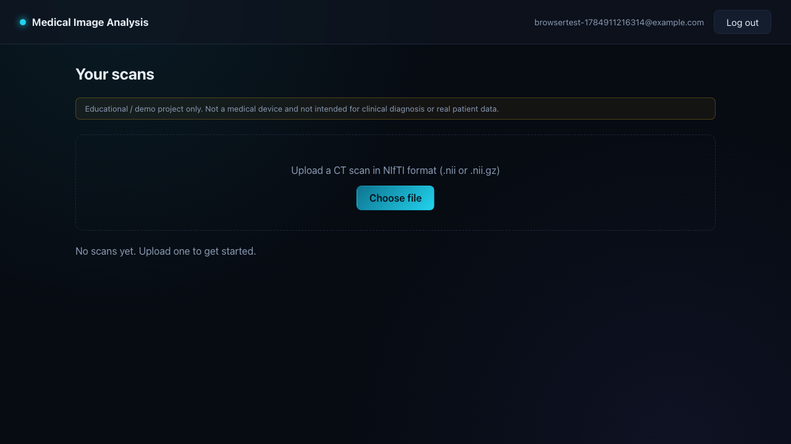
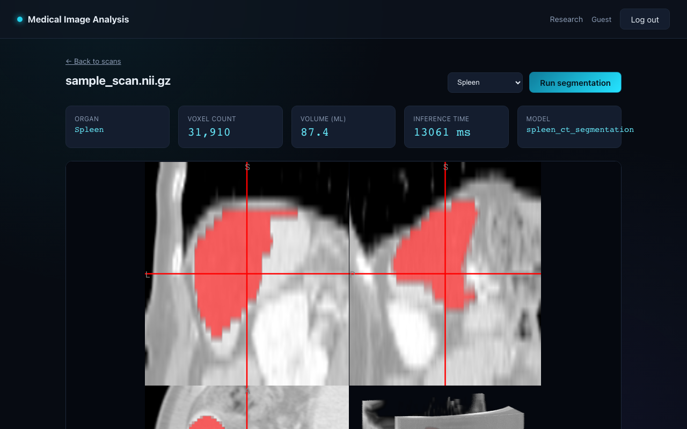

# Medical Image Analysis Platform

A full-stack demo platform for uploading CT scans (NIfTI format), running an
AI segmentation model on them, and viewing the results in the browser.

> **Educational / portfolio project. Not a medical device.** The included
> model is a research-grade demo (trained on a public academic dataset) and
> is not validated for clinical use. Do not upload real patient data.

**Live demo:** [medimg-fronted.onrender.com](https://medimg-fronted.onrender.com) —
click "Try it as a guest" to skip registration, then use the "Download a
sample scan" link on the dashboard if you don't have a `.nii.gz` file handy.
Free-tier hosting, so the first request after a period of inactivity can
take 30s–2min to wake up.




## Architecture

```
React (Vite)  --->  ASP.NET Core API  --->  AI service API  --->  Redis queue
   :5173             :5283 / :8080             :8001                 :6379
                          |                                            |
                     PostgreSQL                                   AI workers
                                                              (MONAI inference)
```

- **Frontend** (`frontend/`): React + TypeScript + Vite. Handles auth,
  scan upload, and volume visualization via [Niivue](https://niivue.github.io/niivue/).
- **Backend** (`backend/MedicalImageAnalysis.Api/`): ASP.NET Core Web API.
  Owns users, JWT auth, scan/file storage, and the lifecycle of segmentation
  jobs. Persists metadata in PostgreSQL via EF Core.
- **AI service** (`ai-service/`): Python + FastAPI + [RQ](https://python-rq.org/).
  The HTTP process only queues work; separate worker processes run two
  pretrained [MONAI](https://monai.io/) Model Zoo bundles depending on the
  chosen organ: `spleen_ct_segmentation` (a dedicated 3D UNet, used for
  spleen) and `wholeBody_ct_segmentation` (a SegResNet trained on 104
  structures, used for liver/kidneys/gallbladder/stomach/pancreas/bladder).

### How segmentation runs

CPU inference takes minutes, so it is a background job rather than an HTTP
request:

1. The browser asks the API to segment a scan. The API uploads the volume to
   the AI service, which puts it on a Redis queue and answers `202` with a
   job id. Nothing waits on the model.
2. A worker picks the job up and reports its progress - stage plus a real
   percentage, counted from the sliding-window patches MONAI actually
   visits - back through Redis.
3. A background service in the API follows the job to completion, collects
   the finished mask and writes the result. **This does not depend on the
   browser staying open**: close the tab, refresh, or restart the API, and
   the run still finishes and shows up on the scan.
4. A failed job is retried with a backoff. One that fails every attempt goes
   to a **dead letter queue** with its traceback and its input volume kept
   for replay, instead of disappearing into the logs.

The queue is bounded (`MAX_QUEUE_DEPTH`, default 50): past that, new jobs are
refused with `503` and a `Retry-After` rather than piling up. Concurrency is
the number of workers - `docker compose up --scale ai-worker=3`.

**What the live demo runs.** Not this. The hosted demo above serves the
earlier synchronous path, because the queue needs one process answering HTTP
and another running inference, and the two do not fit the 512MB a free
instance gets. Measured in a 512MB container: torch imports at 228MB, MONAI
takes that to 307MB, the loaded model to 353MB, and inference peaks at
438MB - 634MB in total with the API process alongside it. The floor is the
libraries, not the tensors, so there is nothing to trim; running the queue
live needs roughly 1GB. `docker compose up` runs the whole thing locally,
workers, progress, retries and dead letter queue included.

See [ai-service/README.md](ai-service/README.md) for the job endpoints, the
dead letter queue tooling, and the full set of tuning knobs.

## Features

- Register / log in (JWT-based auth), or click "Try it as a guest" for an
  instant throwaway account - no form to fill in. Guest accounts (and their
  scan files) are automatically deleted after 24 hours by a background
  cleanup job, so they don't accumulate.
- Upload a CT scan in NIfTI format (`.nii` / `.nii.gz`), or grab the bundled
  sample scan (a real, cropped spleen CT) if you don't have one
- Pick which organ to segment - spleen, liver, kidneys, gallbladder, stomach,
  pancreas, or urinary bladder
- View the scan and segmentation overlay in an interactive 3D viewer
- See segmentation stats (voxel count, estimated volume in mL, inference time,
  which model ran)
- Browse a [research case-study page](frontend/src/pages/ResearchPage.tsx) on
  intracranial haemorrhage segmentation - a portfolio write-up, not a live
  model (see the page itself for why)

## Deploying it live (free)

Want a real public URL instead of running it locally? See
[DEPLOYMENT.md](DEPLOYMENT.md) for a $0/month setup on Render, with
[Neon](https://neon.tech) for Postgres instead of Render's free database
(which expires and needs recreating every 90 days) — this is exactly how
the live demo above is hosted.

## Running it

### Option A: Docker Compose (recommended)

Requires [Docker Desktop](https://www.docker.com/products/docker-desktop/) to
be installed and running.

```bash
cp .env.example .env
# edit .env if you want to change the generated dev secrets

docker compose up --build
```

Then open:
- Frontend: http://localhost:5173
- API (Swagger): http://localhost:5283/swagger
- AI service (docs): http://localhost:8001/docs

The AI service downloads its pretrained weights (~tens of MB) automatically
on the first segmentation job, so the first run will be slower than
subsequent ones.

### Option B: Run everything locally without Docker

Useful if Docker isn't set up yet, or for active development.

**Prerequisites:** Node 20+, .NET 10 SDK, Python 3.11, PostgreSQL.

1. **Database**

   ```bash
   # e.g. via Homebrew on macOS
   brew install postgresql@16
   brew services start postgresql@16
   psql -d postgres -c "CREATE USER medimg WITH PASSWORD 'medimg_dev_password';"
   psql -d postgres -c "CREATE DATABASE medimg OWNER medimg;"
   ```

2. **Redis** (the segmentation queue)

   ```bash
   brew install redis && brew services start redis
   # or: docker run -p 6379:6379 redis:7-alpine
   ```

3. **AI service** - two processes: the HTTP API, and at least one worker.

   ```bash
   cd ai-service
   python3.11 -m venv .venv
   source .venv/bin/activate
   pip install torch --index-url https://download.pytorch.org/whl/cpu
   pip install -r requirements.txt

   export REDIS_URL=redis://localhost:6379/0
   export JOB_DIR=$(pwd)/.jobs
   export MODEL_DIR=$(pwd)/models

   uvicorn app.main:app --reload --port 8001   # terminal 1
   python -m app.worker                        # terminal 2
   ```

4. **Backend API**

   ```bash
   cd backend/MedicalImageAnalysis.Api
   dotnet run --launch-profile http
   ```

   This applies EF Core migrations automatically on startup and listens on
   `http://localhost:5283`.

5. **Frontend**

   ```bash
   cd frontend
   npm install
   npm run dev
   ```

   Open http://localhost:5173.

## Project layout

```
frontend/               React + Vite + TypeScript SPA
backend/
  MedicalImageAnalysis.Api/   ASP.NET Core Web API (auth, scans, storage)
ai-service/             FastAPI job API + RQ workers running MONAI models
docker-compose.yml      Wires all services + Postgres + Redis together
```

## Configuration

Backend settings (`backend/MedicalImageAnalysis.Api/appsettings.json`) and
Docker Compose (`.env`, copy from `.env.example`) both expose:

| Setting | Purpose |
|---|---|
| `ConnectionStrings:Default` | PostgreSQL connection string |
| `Jwt:Key` | Secret used to sign JWTs — **change this** for anything beyond local testing |
| `AiService:BaseUrl` | Where the API reaches the AI service |
| `Storage:Root` | Where uploaded scans / masks are stored on disk |
| `SegmentationJobs:PollIntervalSeconds` | How often the API checks in-flight segmentation jobs |
| `MAX_QUEUE_DEPTH` / `JOB_MAX_ATTEMPTS` / `JOB_RETRY_INTERVALS` | Queue ceiling and retry policy (AI service; see `.env.example`) |

## Security / scope notes

- This is a demo project: JWT secrets and DB passwords ship with insecure
  defaults meant for local use only. Rotate them (`openssl rand -base64 32`)
  before exposing this anywhere beyond your own machine.
- File storage is local disk, not encrypted at rest.
- No rate limiting, audit logging, or HIPAA/PHI safeguards are implemented —
  this is not suitable for real patient data. The segmentation queue is
  bounded, which caps the work a caller can create, but it is not a
  substitute for per-user rate limiting.
- The AI service's job and dead letter queue endpoints are unauthenticated
  and meant to live on an internal network, reachable only through the .NET
  API. Don't expose port 8001 publicly.

## Sample data

`sample_scan.nii.gz` (repo root, and served from the frontend at
`/sample_scan.nii.gz` via the dashboard's "Download a sample scan" link) is
a small crop (around one spleen, generous margin) taken from case
`spleen_15` in the [Medical Segmentation Decathlon](http://medicaldecathlon.com/)
Task09_Spleen dataset - the same public dataset the `spleen_ct_segmentation`
MONAI bundle was trained on. It's cropped down in physical size (not just
resolution) specifically so segmentation completes reliably within a
free-tier host's memory limits, while still being real anatomy rather than
synthetic/placeholder data. Medical Segmentation Decathlon data is licensed
[CC-BY-SA 4.0](https://creativecommons.org/licenses/by-sa/4.0/).

## License

MIT
